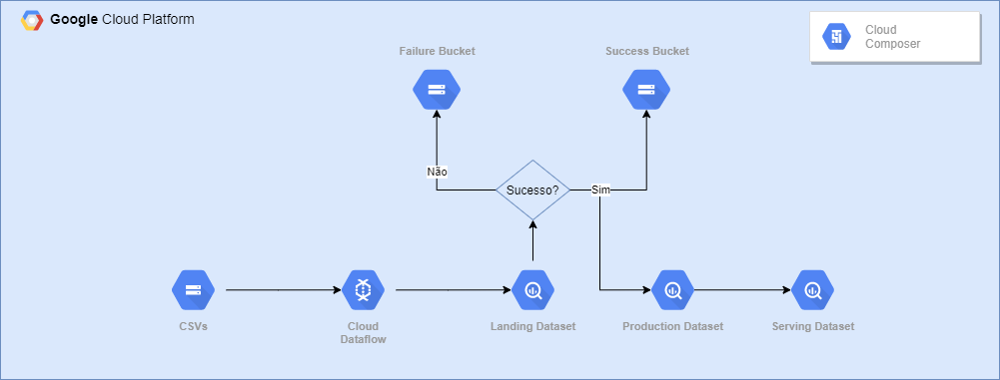

# Teste Engenheiro de Dados - Dotz

## Arquitetura

Para resolução do teste, optei por utilizar as seguintes ferramentas:

* Cloud Shell

    Utilizei para criar toda a infraestrutura, rodar testes e sincronizao o repositório Git com o Bucket de DAGs do Composer.

* Cloud Storage

    Utilizei o storage para fazer a ingestão inicial dos CSVs para o GCP.
    Outra opção considerada foi fazer o upload dos CSVs para uma instância do Cloud SQL. Não segui nessa direção pois iria usar o Dataflow com Python, e acredito que usando Java seria mais natural criar essa conexão usando o conector JDBC, ~~além de aumentar consideravelmente a complexidade da solução~~.

* Cloud Dataflow

    Utilizei para carregar os CSVs do Storage para o BQ, com a SDK em Python.

* Cloud Composer

    Utilizei para encapsular e automatizar o pipeline.

* BigQuery

    Utilizei o BQ como destino final dos dados. Como o teste envolve a criação de um dashboard e a criação de um pequeno datalake, o BQ com sua integração com o Datastudio e capacidades de Data Warehousing se mostrou a ferramenta perfeita.

* DataStudio

    Utilizei para criar o dashboard pedido.

### Implementação

Depois de analisar o problema e os dados, comecei a criar a infraestrutura necessária para o projeto:

1 - Um novo projeto no GCP.

2 - Dataset no BigQuery que recebe as primeiras tabelas criadas à partir dos CSVs, outro para receber os dados tratados e um para criação das views do dashboard:

``` bash
bq mk --data_location us-east1 --dataset landing &&
bq mk --data_location us-east1 --dataset production &&
bq mk --data_location us-east1 --dataset serving
```

3 - Bucket no Storage para fazer o upload dos CSVs e criar o local para arquivos temporários do Dataflow:

``` bash
gsutil mb -c standard -l us-east1 gs://de-dotz-2020
```

4 - Cluster do Composer para utilizar o Airflow.

5 - Fiz o download dos CSVs e utilizei o Cloud SDK para fazer o upload dos arquivos para o bucket criado:

```
gsutil cp %USERPROFILE%/Downloads/csvs/* gs://de-dotz-2020/csvs
```

6 - Para facilitar a organização do código, criei algumas váriaveis no Airflow:
    
    * project_id: ID do projeto criado
    * gcs_bucket: Bucket criado no ponto 3.
    * lading_dataset: Dataset que recebe as primeiras tabelas criadas.
    * production_dataset: Dataset com os dados unificados e com schema definido.
    * serving_dataset: Dataset para consumo dos dados.

7 - Depos disso, criei a DAG no Airflow seguindo o seguinte fluxo:



7.1 - Os CSVs são lidos do storage e gravados no dataset __landing__ no BQ, utilizando o Dataflow. Caso o processo falhe nesse estágio, os CSVs serão movidos para uma pasta chamada "failed" no mesmo bucket. Caso contrário, serão movidos para a pasta "processed".

7.2 - As tabelas são unidas e o schema é definido. A tabela resultante é salva no dataset __production__.

7.3 - São criadas Views no dataset __serving__ que irão alimentar o dashboard.

8 - Por fim, criei o [dashboard](https://datastudio.google.com/s/lcaXNiu1828) no Datastudio.


## Instruções

1. Crie três Datasets no BigQuery:
    * landing
    * production
    * serving

2. Crie um bucket no Storage.

3. Crie uma pasta no bucket criado e faça o upload dos arquivos csv para ela.

4. Crie um cluster no Composer.

5. No webserver do Airflow, crie as variáveis:
    * project_id: ID do projeto que está sendo utilizado.
    * gcs_bucket: Caminho do Bucket criado no ponto 2. (gs://nome-do-bucket)
    * lading_dataset: landing (ou outro dataset no BQ).
    * production_dataset: production (ou outro dataset no BQ).
    * serving_dataset: serving (ou outro dataset no BQ).

6. No Cloud Shell, faça o _git clone_ do repositório: https://github.com/dougpm/de-dotz

7. Abra o editor. No arquivo dag_ingestion.py, na linha 76, coloque o nome da pasta criada no bucket, contendo os arquivos.

``` python
csvs_folder = "NOME_DA_PASTA_CRIADA"
```

8. Coloque a pasta de-dotz no bucket de DAGs do Composer e execute a DAG (certificar-se de que a API do Dataflow esta ativada). O script sync_composer.sh pode ser utilizado. Para isso, basta alterar o arquivo com o nome do bucket do Composer.

``` bash
#!/bin/bash

cd de-dotz
git pull https://github.com/dougpm/de-dotz
gsutil -m rsync -d -r $HOME/de-dotz/ gs://BUCKET_DO_COMPOSER_AQUI/dags/dotz
```

E depois rodar o script:

``` bash
cd $HOME &&
mv de-dotz/sync_composer.sh . &&
chmod +x sync_composer.sh &&
./sync_composer.sh
```

9. Depois disso, todas as tabelas estarão criadas no BigQuery.


